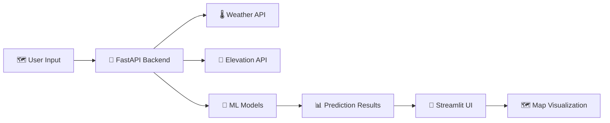

# 🔥 Fire Spread Prediction System

<div align="center">


<br/>


</div>

<br/>

<div align="center">
  
</div>

---

## 🌟 Overview

**Fire Spread Prediction System** is a minimalistic AI-powered application that predicts wildfire spread patterns based on location and environmental factors. Built entirely in Python with FastAPI backend and Streamlit frontend, it provides real-time predictions using pre-trained machine learning models.

<div align="center">

```ascii
📍 Location Input → 🤖 AI Analysis → 📊 Visualization
        ↓                ↓                ↓
   Click Map     →  FastAPI API   →  Streamlit UI
```

</div>

### ✨ Key Features

- 🗺️ **Interactive Map** - Click to select fire location or enter coordinates manually
- 🤖 **AI Predictions** - Pre-trained Gradient Boosting models for spread probability and distance
- 🌡️ **Real-time Weather** - Automatic weather data integration via Open-Meteo API
- 📊 **GeoJSON Visualization** - View predicted spread patterns on the map
- 🐍 **Pure Python** - FastAPI backend + Streamlit frontend
- 🚀 **No Database Required** - Lightweight on-demand predictions

---

## 🚀 Quick Start

### 📋 Prerequisites

- 🐍 **Python 3.11+** - Required for both backend and frontend
- 📦 **pip** - Python package manager

### 🛠️ Installation

#### 1️⃣ Clone the Repository

```bash
git clone https://github.com/YourUsername/Fire-Prediction-system.git
cd Fire-Prediction-system
```

#### 2️⃣ Backend Setup (FastAPI)

```bash
cd backend
pip install -r requirements.txt
```

**Start the backend server:**

```bash
python main.py
```

The API will be available at `http://localhost:8000`

- API Docs: `http://localhost:8000/docs`
- Health Check: `http://localhost:8000/health`

#### 3️⃣ Frontend Setup (Streamlit)

Open a new terminal window:

```bash
cd frontend
pip install -r requirements.txt
```

**Start the Streamlit app:**

```bash
streamlit run app.py
```

The app will open automatically at `http://localhost:8501`

---

## 🏗️ System Architecture

### 📁 Project Structure

```
Fire-Prediction-System/
│
├── backend/                   # FastAPI Backend
│   ├── main.py               # FastAPI application
│   ├── prediction.py         # ML prediction logic
│   ├── requirements.txt      # Backend dependencies
│   └── ml/                   # ML models directory
│       ├── wildfire_spread_classifier_advanced.joblib
│       └── wildfire_spread_regressor_advanced.joblib
│
├── frontend/                 # Streamlit Frontend
│   ├── app.py               # Streamlit application
│   └── requirements.txt     # Frontend dependencies
│
└── README.md
```

### 🔄 Data Flow



---

## 🧠 Machine Learning Models

### 🎯 Dual Model Architecture

| Model Type | Algorithm | Purpose | File |
|:----------:|:---------:|:-------:|:----:|
| 🔍 **Classifier** | Gradient Boosting | Spread Probability | `wildfire_spread_classifier_advanced.joblib` |
| 📏 **Regressor** | Gradient Boosting | Spread Distance | `wildfire_spread_regressor_advanced.joblib` |

### 📈 Features Used

**🌍 Environmental Factors:**
- Elevation data (from Open-Meteo Elevation API)
- Vegetation index (seasonal estimation)
- Drought index (regional estimation)

**🔥 Fire Characteristics:**
- Brightness/intensity values
- Location coordinates (lat/lng)

**🌡️ Weather Conditions:**
- Temperature (real-time via API)
- Humidity (real-time via API)
- Wind speed & direction (real-time via API)

---

## 🎮 Usage Guide

### 📍 Method 1: Map Click

1. Select "Map Click" in the sidebar
2. Click anywhere on the map to select a fire location
3. Adjust fire brightness if needed (100-800)
4. Click "🚀 Predict Fire Spread"

### ⌨️ Method 2: Manual Input

1. Select "Manual Input" in the sidebar
2. Enter latitude and longitude coordinates
3. Adjust fire brightness if needed
4. Click "🚀 Predict Fire Spread"

### 📊 Understanding Results

The prediction provides:
- **Will Spread?** - Binary classification (YES/NO)
- **Spread Probability** - Confidence percentage
- **Spread Distance** - Estimated distance in kilometers
- **Spread Direction** - Wind-driven direction in degrees
- **Environmental Data** - Weather and terrain factors used
- **Map Visualization** - Spread polygon and direction arrow

---

## 🔧 API Documentation

### POST `/predict`

Predict fire spread based on location and brightness.

**Request Body:**
```json
{
  "lat": 34.05,
  "lng": -118.25,
  "brightness": 350
}
```

**Response:**
```json
{
  "will_spread": true,
  "spread_probability": 0.85,
  "spread_ratio": 2.3,
  "spread_direction": 270,
  "spread_distance_km": 3.45,
  "environmental_data": {
    "elevation": 500,
    "wind_direction": 270,
    "wind_speed": 15.5,
    "temperature": 32.1,
    "humidity": 25.3,
    "drought": 4.2,
    "vegetation": 0.35,
    "brightness": 350,
    "data_source": "weather_api"
  },
  "geojson": {
    "type": "FeatureCollection",
    "features": [...]
  }
}
```

---

## 📦 Dependencies

### Backend Requirements

```
fastapi==0.109.0
uvicorn[standard]==0.27.0
pydantic==2.6.0
numpy==1.26.3
joblib==1.3.2
scikit-learn==1.4.0
requests==2.31.0
python-multipart==0.0.6
```

### Frontend Requirements

```
streamlit==1.30.0
folium==0.15.1
streamlit-folium==0.18.0
requests==2.31.0
```

---

## 🌐 External APIs Used

- **🌡️ Open-Meteo Weather API** - Real-time weather data (free, no key required)
- **🗻 Open-Meteo Elevation API** - Elevation data (free, no key required)

---

## 🔬 Model Retraining (Optional)

If you want to retrain the models with new data:

```bash
cd backend/ml

# Process training data
python process_data_dual.py

# Train classifier model
python train_classifier_advanced.py

# Train regressor model
python train_regressor_advanced.py
```

---

## 🐳 Docker Deployment (Optional)

Create a `docker-compose.yml`:

```yaml
version: '3.8'

services:
  backend:
    build: ./backend
    ports:
      - "8000:8000"
    
  frontend:
    build: ./frontend
    ports:
      - "8501:8501"
    depends_on:
      - backend
```

Run with:
```bash
docker-compose up
```

---

## 🤝 Contributing

Contributions are welcome! Areas for improvement:

- 🤖 **ML Models** - Improve accuracy with more features
- 🎨 **UI/UX** - Enhance visualization and user experience
- 📡 **Backend** - Add caching, rate limiting, etc.
- 📖 **Documentation** - Expand guides and examples

---

## 📄 License

This project is licensed under the **MIT License** - see the LICENSE file for details.

---

## 🙏 Acknowledgments

- 🌡️ **Open-Meteo** - Free weather and elevation APIs
- 🧠 **scikit-learn** - Machine learning framework
- ⚡ **FastAPI** - Modern web framework
- 🎨 **Streamlit** - Interactive UI framework

---

<div align="center">

### 🔥 Ready to Predict Fire Spread?

[](https://github.com/YourUsername/Fire-Prediction-system.git)

<br/>

**Made with ❤️ and 🐍 for wildfire prediction and safety**

*"Predict, analyze, and visualize wildfire spread with AI"*


</div>
